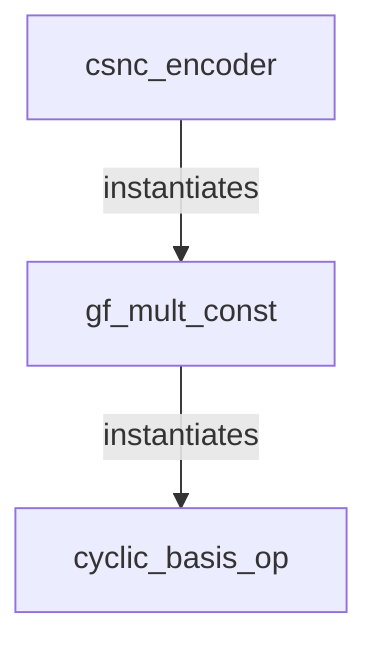

# RTL 设计说明 (CSNC Encoder)

本文档详细说明了 `rtl/csnc_encoder.v` 的硬件设计架构、接口定义及实现原理。该模块实现了一个基于 **(9, 5) MDS 码** 的纠删码编码器，利用循环移位和异或操作在硬件中高效实现有限域乘法。

## 1. 系统概览

`csnc_encoder` 是一个纯组合逻辑模块，无时钟输入（Combinational Logic），支持单周期编码。

*   **输入**: 5 个数据符号 ($m=5$)
*   **输出**: 9 个编码符号 ($k=9$)，其中前 5 个为原始数据（系统码），后 4 个为校验符号。
*   **符号宽度**: 每个符号 $L-1 = 10$ bits ($L=11$)。
*   **总位宽**: 输入 50 bits $	o$ 输出 90 bits。

### 模块层级



## 2. 接口定义

| 信号名 | 方向 | 位宽 | 描述 |
| :--- | :--- | :--- | :--- |
| `data_in` | Input | [49:0] | 5 个输入符号的拼接。`data_in[9:0]` 为符号 0，以此类推。 |
| `data_out` | Output | [89:0] | 9 个输出符号的拼接。前 50 位为原始数据，后 40 位为校验数据。 |

**参数配置**:
*   `L = 11`: 循环移位维度。
*   `W = 10`: 实际数据位宽 ($L-1$).

## 3. 核心子模块

### 3.1 `cyclic_basis_op` (基础移位算子)

这是算法的核心，实现了“升维 $	o$ 循环移位 $	o$ 降维”的映射过程。

*   **输入**: $L-1$ 维向量 $\mathbf{u}$
*   **参数**: `SHIFT` (移位量 $i$)
*   **操作流程**:
    1.  **扩展 (Expand)**: $\mathbf{u}' = [\mathbf{u}, 0]$ (补零扩展至 $L$ 维)。
    2.  **循环移位 (Cyclic Shift)**: 将 $\mathbf{u}'$ 循环右移 `SHIFT` 位得到 $\mathbf{v}$。
    3.  **投影 (Project)**: 将 $L$ 维向量 $\mathbf{v}$ 压缩回 $L-1$ 维。
        *   公式: $\mathbf{w}[k] = \mathbf{v}[k+1] \oplus \mathbf{v}[0]$
        *   这实际上实现了模多项式 $P(x) = \sum x^i$ 的归约。

```verilog
// 核心 Verilog 逻辑
assign expanded = {in_vec, 1'b0};
assign shifted = (expanded >> SHIFT) | (expanded << (L - SHIFT));
// Project loop...
assign out_vec[i] = shifted[i+1] ^ shifted[0];
```

### 3.2 `gf_mult_const` (有限域常数乘法器)

利用线性性质，将有限域上的常数乘法 $\beta \cdot x$ 转化为多个移位基向量的线性组合。

*   **输入**: 向量 $x$，常数系数 `COEFF` (整数表示)。
*   **原理**:
    如果 `COEFF` 的二进制表示第 $i$ 位为 1，则累加 `cyclic_basis_op(SHIFT=i)` 的结果。
    $$ \text{Out} = \sum_{i \in \text{bits}(\text{COEFF})} \text{cyclic\_basis\_op}(x, i) $$
*   **实现**: 使用 `generate` 语句并行实例化多个 `cyclic_basis_op`，最后将结果异或 (`^`) 在一起。

## 4. 顶层编码器逻辑 (`csnc_encoder`)

顶层模块硬编码了一个 (9, 5) 的 Vandermonde 生成矩阵。

$$ 
\mathbf{G} = \begin{bmatrix} \mathbf{I}_{5 \times 5} \\ \mathbf{P}_{4 \times 5} \end{bmatrix} 
$$ 

其中 $\mathbf{P}$ 矩阵的系数被硬编码在 Verilog 中：

```verilog
// Parity 0 (Col 5) calculation
// Coeffs: [1, 11, 69, 743, 19]
gf_mult_const #(.COEFF(1))   m00 ...
gf_mult_const #(.COEFF(11))  m01 ...
...
assign p[0] = m00_out ^ m01_out ^ ...;
```

这种结构保证了任意丢失 4 个包以内的数据都能被恢复。

## 5. 资源消耗与优势

*   **零乘法器**: 整个设计仅使用了 **XOR 门** 和 **布线资源**。
*   **低延迟**: 纯组合逻辑路径，延迟主要取决于 XOR 树的深度（约为 $\log_2(L) + \log_2(m)$ 级）。
*   **可流水线化**: 如果需要运行在极高频率，可以在 `gf_mult_const` 的输出级插入流水线寄存器。

```
