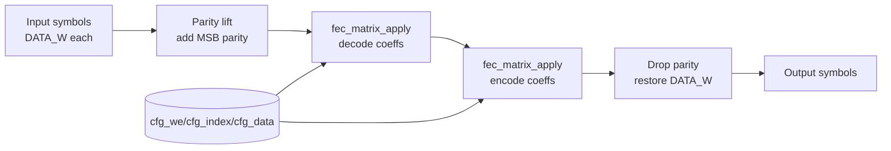

# Finite-Field FEC Codec RTL

This directory holds a hardware-friendly rendition of the packet FEC pipeline sketched in `encoder.py` and exercised by `matrix/matrix_test.py`.  The RTL mirrors the Python stages so you can co-verify the implementations symbol-by-symbol.

## Data Flow
- Symbols arrive as `M` parallel words of width `DATA_W` (the Python code calls this `length - 1`).
- `fec_codec` adds a parity bit to each word, yielding the `WIDTH = DATA_W + 1` cyclic-shift domain used by the matrix arithmetic.
- The decoder stage applies the inverse Vandermonde matrix (`M × M`) using XOR plus barrel shifts, matching `apply_matrix(decode_coeffs, …)` in Python.
- The encoder stage applies the selected Vandermonde rows to rebuild the transmit set.
- Parity bits are dropped to restore the original symbol width.

## Modules
- `fec_matrix_apply.sv` – combinational matrix engine that consumes an `M × N` coefficient array and `N` input symbols and emits `M` outputs; helper functions for popcount/rotation live here.
- `fec_codec.sv` – combinational codec wiring parity lift → decode → encode → parity drop with debug taps.
- `fec_codec_stream.sv` – registered streaming wrapper with ready/valid handshakes and a lightweight CSR port (`cfg_we`, `cfg_select`, `cfg_index`, `cfg_data`) for loading Vandermonde coefficients at run time.  Debug busses expose the lifted/decoded/encoded snapshots.
- `fec_codec_tb.sv` – combinational smoke test that hard-wires the matrices for seed `42`, `packets=[0,3,4]`.
- `fec_codec_stream_tb.sv` – drives the streaming wrapper, programs its coefficient store, and cross-checks the debug taps against the Python trial.

All RTL is written in synthesizable SystemVerilog.  Parameters let you retarget different symbol counts/lengths without touching the logic.

## Feeding Coefficients
The Python harness already computes the matrices you need:

```bash
python matrix/matrix_test.py  # assumes requirements.txt is installed
```

Use `Van(m, k, length - 1)` with the desired packet selection to dump:

```python
decode = van.invert(packets)          # shape (M, M)
encode = van.M[:, packets]            # shape (M, M)
```

Populate the testbench arrays (or a small ROM/CSR block in your design) with these `WIDTH`-bit integer coefficients.  They map 1:1 onto the Verilog coefficient arrays.

For the streaming wrapper, write `M × M` entries into the decode plane (`cfg_select=0`) followed by the encode plane (`cfg_select=1`).  The row-major index is `cfg_index = row * M + col`.

## Simulation Quickstart (Vivado xsim)
```bash
# from Windows CMD (Vivado 2025.1)
xvlog -sv fec_matrix_apply.sv fec_codec.sv fec_codec_tb.sv fec_codec_stream.sv fec_codec_stream_tb.sv
xelab work.fec_codec_tb -s fec_codec_tb
xsim  fec_codec_tb -runall
xelab work.fec_codec_stream_tb -s fec_codec_stream_tb
xsim  fec_codec_stream_tb -runall
```

Or run both automatically:

```bash
vivado -mode batch -source fec_codec_sim.tcl        # default temp workdir beside the script
vivado -mode batch -source fec_codec_sim.tcl -- -work D:/tmp/fec -skip_core_tb
```

## Reference Trials
The Python harness (`matrix_test.py`) can emit snapshots for any RNG seed.  The table below shows three representative runs; the HDL testbenches are preloaded with the `seed=42` case.

| seed | packets   | stage                 | width | symbol0      | symbol1      | symbol2      |
|------|-----------|-----------------------|-------|--------------|--------------|--------------|
| 7    | [2,3,4]   | input                 | 10    | 0011000110   | 1000001110   | 0010101101   |
|      |           | lift_to_cyclic_domain | 11    | 00011000110  | 01000001110  | 10010101101  |
|      |           | fec_decode            | 11    | 11010111000  | 11110000110  | 11101000000  |
|      |           | fec_encode            | 11    | 00011000110  | 01000001110  | 10010101101  |
|      |           | trim_zero_padding     | 10    | 0011000110   | 1000001110   | 0010101101   |
| 13   | [2,3,4]   | input                 | 10    | 1011010100   | 1011001010   | 0111110110   |
|      |           | lift_to_cyclic_domain | 11    | 11011010100  | 11011001010  | 10111110110  |
|      |           | fec_decode            | 11    | 10111101110  | 10110111011  | 01101101111  |
|      |           | fec_encode            | 11    | 11011010100  | 11011001010  | 10111110110  |
|      |           | trim_zero_padding     | 10    | 1011010100   | 1011001010   | 0111110110   |
| 42   | [0,3,4]   | input                 | 10    | 1011110001   | 1111101000   | 1011101100   |
|      |           | lift_to_cyclic_domain | 11    | 01011110001  | 01111101000  | 01011101100  |
|      |           | fec_decode            | 11    | 11110100010  | 00100110001  | 10001100010  |
|      |           | fec_encode            | 11    | 01011110001  | 01111101000  | 01011101100  |
|      |           | trim_zero_padding     | 10    | 1011110001   | 1111101000   | 1011101100   |

## Datapath Sketch



## Integration Notes
- The codec is purely combinational; wrap it in a register shell if you need pipelining or streaming handshakes.
- Coefficients can be hard-wired parameters, configuration registers, or BRAM contents.
- The symbol functions expect the same “flip heavy masks” rule as the Python `CyclicMatrix.flip_bits` helper to minimize rotation weight.
- To emulate packet loss, zero out the corresponding columns before the encode stage.

Record any verification runs (Python seed, matrices, HDL simulation command) so they can be replayed later.
